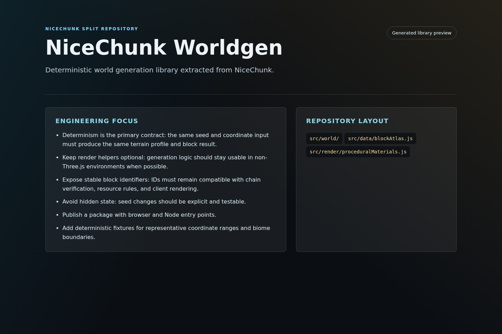

# NiceChunk Worldgen

Deterministic world generation library extracted from NiceChunk.

## Project Overview

This repository isolates the deterministic world generation logic used by NiceChunk. It is meant to be imported by other projects that need the same seeded terrain behavior without depending on the full game client.

The library includes world configuration, block IDs, chunk keys, terrain profile generation, generated block lookup, world state helpers, fluid behavior, and rendering support modules.

The split is important because world generation is a protocol-level behavior. If the client, scripts, and future services do not agree on generated terrain, the chain verification layer cannot be trusted.

## System Principles

- Determinism is the primary contract: the same seed and coordinate input must produce the same terrain profile and block result.
- Keep render helpers optional: generation logic should stay usable in non-Three.js environments when possible.
- Expose stable block identifiers: IDs must remain compatible with chain verification, resource rules, and client rendering.
- Avoid hidden state: seed changes should be explicit and testable.

## How It Works

- Import the generator and configuration modules into a browser, script, or simulation environment.
- Set the world seed explicitly before generating terrain or blocks.
- Use terrain profiles for higher-level resource and biome decisions, and generated block lookup for exact coordinate behavior.
- Pair changes with fixture tests so downstream projects can detect deterministic output changes.

## Why This Project Matters

Worldgen is the shared truth beneath exploration, resource discovery, generated-block verification, and visual terrain. Making it a standalone project lets other tools build on NiceChunk's world without inheriting the entire client.

A separate worldgen repository also makes algorithm review more focused. Contributors can discuss biome rules, terrain shaping, and deterministic guarantees in one place.

## Repository Layout

- `src/world/`
- `src/data/blockAtlas.js`
- `src/render/proceduralMaterials.js`

## Development Workflow

1. Clone the repository and inspect the focused source tree before changing shared contracts or generated artifacts.
2. Keep changes scoped to the domain of this repository. Cross-domain changes should be coordinated through the matching split repositories.
3. Run the smallest meaningful validation for the touched surface: build checks for programs, browser checks for pages, or fixture checks for deterministic libraries.
4. Update screenshots and documentation when behavior, visible UI, public constants, or developer-facing workflows change.

## Future Development Direction

- Publish a package with browser and Node entry points.
- Add deterministic fixtures for representative coordinate ranges and biome boundaries.
- Split pure generation from rendering adapters.
- Document compatibility guarantees for world seed versions and block ID evolution.

## Maintenance Notes

This repository is a focused split from the main NiceChunk working tree. Keep the public surface explicit: avoid committing private keys, wallet files, deployment-only scripts, machine-specific configuration, or generated build artifacts. Runtime user-facing copy should stay behind the i18n layer where the project has an i18n surface.
